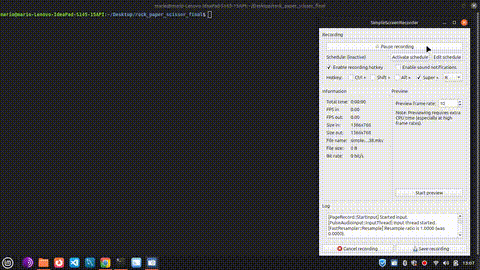

# Rock Paper Scissor Game 🎮

A classic Rock-Paper-Scissors game developed in Python as part of my Business Application Developer portfolio.

## 🚀 Features
- Interactive CLI gameplay.
- Modular code structure (utils.py for logic).
- Input validation to ensure a smooth user experience.

## Game Demo

## 🛠️ How to run
1. Clone the repository:
   `git clone https://github.com/mario7gs/rock-paper-scissor-game.git`
2. Run the main script:
   `python3 r_p_s_main.py`

## 🎓 Education
Developed during my studies at **ITS ICT Piemonte**.
